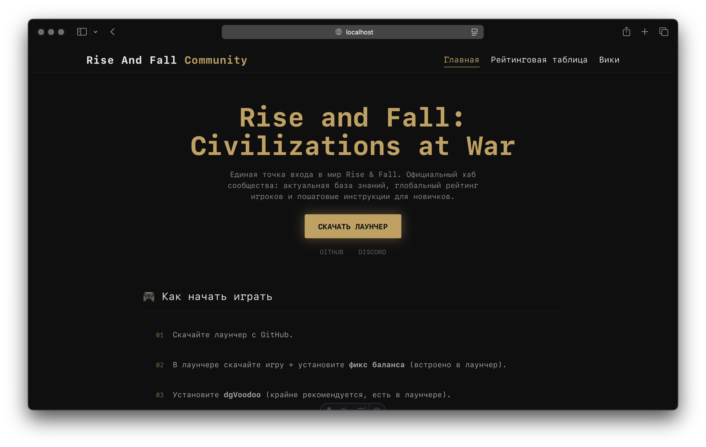

<div align="center">

# ⚔️ Rise And Fall Community Hub

🇷🇺 [Русский](#-русская-версия) | 🇬🇧 [English](#-english-version) | 🇺🇦 [Українська](#-українська-версія)




</div>

---

## 🇬🇧 English version

<a id="-english-version"></a>

## 📖 About the project

This project is a central hub for **Rise and Fall** players. It combines a knowledge base (Wiki), a global leaderboard system, and step-by-step guides. The site is built by xxds for the community with a strong focus on extreme loading speed.

## ⚡️ Why pure Astro is used

The project is intentionally built using **pure Astro without additional JS libraries**:

* **No-JS approach** — minimal JavaScript on the client
* **Static Site Generation (SSG)** — pages are prebuilt and served instantly
* **Extreme performance** — optimized for near-instant page loading

Additionally, **Bun** is used:

* built-in TypeScript support
* fast dependency installation and builds
* improved developer experience and speed

## 🧠 Leaderboard

The site includes an **auto-updating leaderboard**.

Key idea:

* data is fetched **directly in the user's browser**
* updates happen in real time
* no load on the rendering server (since the site is static)

This provides a balance between:

* ⚡ speed
* 🔄 real-time data

## 🚀 Features

* **14KB TCP Optimized** — most pages load within a single TCP window
* **Smart Wiki** — auto-generated TOC and navigation
* **Responsive Design** — works on mobile and desktop
* **Sticky Sidebars** — удобное чтение длинных гайдов

---

## 🇷🇺 Русская версия

<a id="-русская-версия"></a>

> ❗ **НЕТ ВОЙНЕ**

## 📖 О проекте

Этот проект — центральный узел для игроков **Rise and Fall**. Он объединяет в себе базу знаний (Wiki), глобальную рейтинговую систему и пошаговые руководства. Сайт создан xxds для комьюнити с упором на экстремальную скорость загрузки.

## ⚡️ Почему используется чистый Astro

Проект намеренно построен на **чистом Astro без дополнительных JS-библиотек**:

* **No-JS подход** — минимальное количество JavaScript на клиенте
* **Статическая генерация (SSG)** — страницы заранее собираются и отдаются максимально быстро
* **Экстремальная производительность** — идеально подходит под цель: мгновенная загрузка страниц

Дополнительно используется **Bun**:

* встроенная поддержка TypeScript
* быстрый билд и установка зависимостей
* уменьшение времени разработки и сборки

## 🧠 Лидерборд

На сайте присутствует **автообновляемый лидерборд**.

Особенность:

* запрос выполняется **на стороне браузера пользователя**
* данные подтягиваются в реальном времени
* отсутствует нагрузка на сервер рендера (так как сайт статический)

Это позволяет сохранить баланс между:

* ⚡ скоростью загрузки
* 🔄 актуальностью данных

## 🚀 Фишки

* **14KB TCP Optimized** — большинство страниц загружаются за один TCP-цикл
* **Smart Wiki** — автогенерация оглавления и удобная навигация
* **Responsive Design** — корректная работа на телефонах и десктопах
* **Sticky Sidebars** — удобство чтения длинных гайдов

## 🛠 Быстрый старт

### Установка зависимостей

```bash
bun install
```

### Запуск в режиме разработки

```bash
bun run dev
```

### Сборка проекта

```bash
bun run build
```

Готовый сайт будет находиться в папке `dist/`.

---

## 🇺🇦 Українська версія

<a id="-українська-версія"></a>

## 📖 Про проєкт

Цей проєкт — центральний хаб для гравців **Rise and Fall**. Він поєднує базу знань (Wiki), глобальну рейтингову систему та покрокові гайди. Сайт створений xxds для комʼюніті з акцентом на максимальну швидкість завантаження.

## ⚡️ Чому використовується чистий Astro

Проєкт свідомо побудований на **чистому Astro без додаткових JS-бібліотек**:

* **No-JS підхід** — мінімум JavaScript на клієнті
* **Статична генерація (SSG)** — сторінки генеруються заздалегідь
* **Максимальна продуктивність** — миттєве завантаження сторінок

Додатково використовується **Bun**:

* вбудована підтримка TypeScript
* швидка збірка та встановлення залежностей
* швидша розробка

## 🧠 Лідерборд

На сайті є **автооновлюваний лідерборд**.

Особливість:

* запит виконується **у браузері користувача**
* дані оновлюються в реальному часі
* відсутнє навантаження на сервер рендерингу

Це дозволяє поєднати:

* ⚡ швидкість
* 🔄 актуальність даних

## 🚀 Фічі

* **14KB TCP Optimized** — швидке завантаження
* **Smart Wiki** — автогенерація змісту
* **Responsive Design** — підтримка мобільних пристроїв
* **Sticky Sidebars** — зручне читання гайдів

---

<div align="center">

Зроблено для комʼюніті Rise and Fall 🇺🇦

</div>
